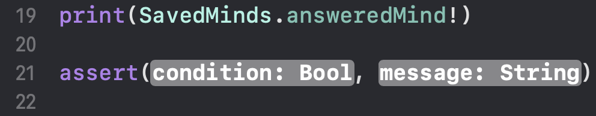
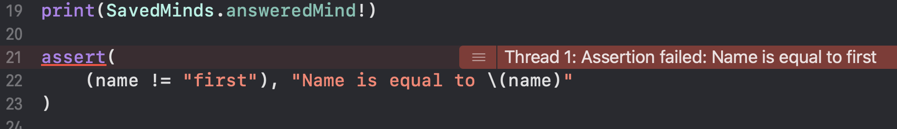
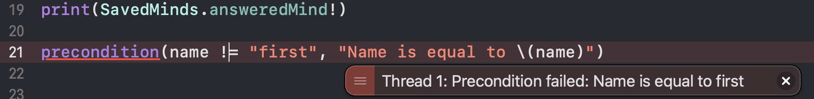
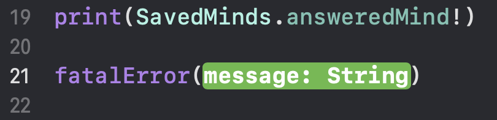
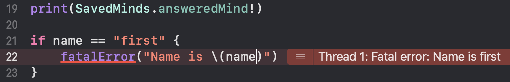

# XCode Notes

## Useful Commands

1. print(variableToPrint)
2. assert -- stops executing program if condition is true, shows `message:` as an error message (works during debug only)

3. precondition -- similar to assert, but also works during user in use (helpful if needed to stop executing program because of an error happened)

4. fatal error (always returns 'Never' -- used to stop execution with fatal error)

## Shell Commands
