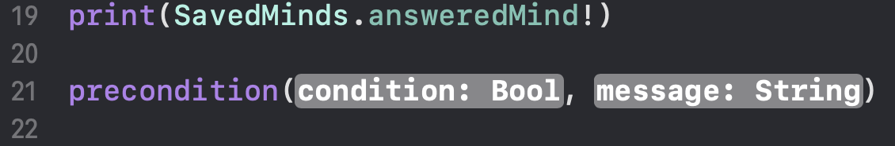

# XCode Notes

## Useful Commands

1. print(variableToPrint)
2. assert -- stops executing program if condition is true, shows `message:` as an error message (works during debug only)

3. precondition -- similar to assert, but also works during user in use (helpful if needed to stop executing program because of an error happened)

4. fatal error

Always returns 'Never' -- used to stop execution with fatal error. Fatal error definition:

## Shell Commands

1. `po $arg1` -- shows the error text without garbage (po == print object)
2. `watchpoint set variable VariableName` -- sets watching variable. Same is `w s v VariableName`
3. `bp s -o -f File.swift -l 44` -- sets a break point
    - `bp` - breakpoint
    - `s` - set
    - `-o` - one-shot. Breakpoint would be deleted after the first use
    - `-f File.swift` - File where breakpoint would be set
    - `-l 44` - line to set BP

## Breakpoints

1. Set a breakpoint at code (green flag on the left)
2. Open Breakpoints view in Navigator
3. Right-click on a breakpoint > Edit breakpoint

4. Fill the "Condition" field

5. Add Action button

You may choose various options (Log message, Debugger Command and else)

